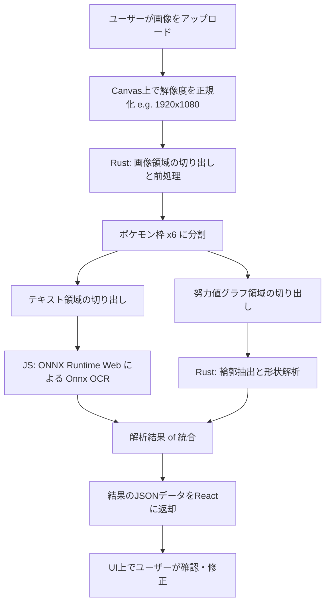

# 04_wasm_image_analysis_design.md - WASM画像解析の技術方針と詳細設計 (Onnx OCR対応)

本ドキュメントでは、ブラウザ上（WebAssembly / WebGL）で動作する **ONNX Runtime Web** を用いた Onnx OCR 技術方針、認識アルゴリズム、および画像処理スタックについて計画します。

---

## 1. 解析対象と目標データ

解析対象は、ゲーム内（ポケモンチャンピオンズ）のパーティ詳細画面または対戦準備画面のスクリーンショットです。
ここから以下の情報をローカル（WASM）で自動抽出することを目指します。

1. **ポケモンの名前 / 性格 / 特性 / 技 (4つ)**:
   - ディープラーニングベースの **Onnx OCR** を使用してテキスト認識を行います。
2. **努力値の割り振り**:
   - グラフ（レーダーチャート）として表示される部分をトリミングし、画像処理（二値化・輪郭検出）によって形状を数値化します。

---

## 2. 技術的アプローチの選定

高精度な文字認識と高速なローカル実行を実現するため、以下のハイブリッド構成を採用します。

### 2.1 文字認識（OCR）: ONNX Runtime Web (WASM) 【★採用決定】
- **方法**: 
  - ブラウザ上のWebAssembly/WebGL/WebGPUでONNXモデルを実行する `onnxruntime-web` ライブラリを採用。
  - 軽量で認識精度の高い日本語・英語対応のOCRモデル（例: PaddleOCR の ONNX 形式等）をロード。
  - 画面内の文字領域（名前、性格、技など）を検出し、テキストに変換します。
- **メリット**:
  - ゲーム特有 of フォント、背景のグラデーション、低解像度でも文字を極めて正確に認識可能。
  - 新しいポケモンや技が追加されても、アセットやテキストデータのマスター情報を追加するだけで動作し、画像テンプレートを個別に用意する必要がありません。
- **デメリット**:
  - OCR用のONNXモデル（数MB）およびONNX RuntimeのWASMモジュール（1〜2MB）を初期ロードする必要があります（Cloudflare Pagesで効率よくキャッシュさせることで緩和します）。

### 2.2 努力値解析: Rust (WASM) による画像解析
- **方法**: 
  - 努力値グラフ（六角形のレーダーチャートなど）が描かれている領域をトリミング。
  - Rustの `imageproc` を使って二値化、ノイズ除去を行い、輪郭検出で中心点からの頂点距離を測定し、各努力値（H/A/B/C/D/S）の割り振りをパーセンテージで推定します。

---

## 3. 画像解析・推論スタック

フロントエンド（JS/TS）とRust（WASM）、ONNX推論器のそれぞれの強みを活かしたハイブリッド設計とします。

- **`onnxruntime-web` (JavaScript/TypeScript)**:
  - ONNXモデルのロードおよび推論処理（WASM/WebGL/WebGPUアクセラレーション）を担当。
- **Rust + WASM (`wasm-bindgen` / `web-sys` / `image` / `imageproc`)**:
  - 画像の切り出し（スロット分割）や、コントラスト調整・二値化などのOCR前処理。
  - 努力値グラフの形状解析（輪郭抽出、重心・頂点計算）。
  - 軽量かつ高速なピクセル操作の実行。

---

## 4. 解析パイプライン（処理の流れ）

---

## 5. 開発ロードマップへの影響

Onnx OCRの導入に伴い、以下のタスクを実装ロードマップに追加します。
- **モデルの準備**: ウェブ用に最適化・軽量化された日本語/英語対応のONNX OCRモデルの選定・軽量化（Quantization）。
- **WASMランタイム設定**: Vite環境で `onnxruntime-web` の WASM ファイル（`.wasm`）を正しく参照・ホストするための設定。
