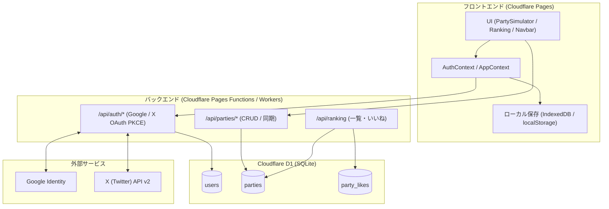
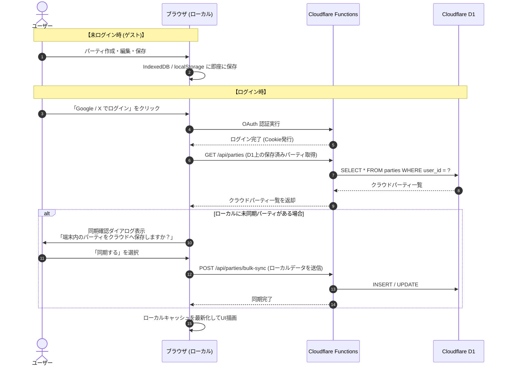
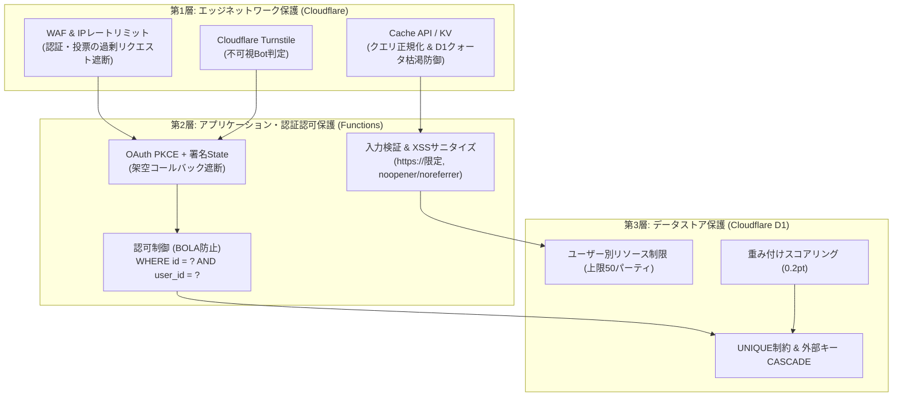

# 計画書 104: Cloudflare D1 によるユーザー認証 (Google / X) とパーティデータ同期・ランキング設計

## 1. 概要と背景
現在、パーティシミュレータのデータはブラウザのローカル（localStorage / IndexedDB）に保存されており、端末間のデータ移行や共有はBase62のURLパラメータ経由で行っています。
本計画では、以下の機能を追加・統合するためのシステムアーキテクチャおよび実装手順を定義します：

1. **OAuth 2.0 ユーザー認証**: Google および X (Twitter) によるサインイン機能
2. **Cloudflare D1 によるデータ永続化**: クラウドDBへのパーティ情報・構築記事URL・レンタルコードの保存
3. **ローカル ⇄ クラウドのハイブリッド同期**: 未ログイン時のローカルデータをログイン時に D1 へ安全に連携・取得
4. **お気に入り（Like）＆ランキング機能**: 公開パーティのランキング表示、重複防止付きのいいね機能

---

## 2. システムアーキテクチャ設計

### 2.1 全体構成図


---

## 3. データベーススキーマ設計 (Cloudflare D1)

SQLite 互換の D1 に以下の3テーブルを構築します。

```sql
-- 1. ユーザー情報テーブル
CREATE TABLE IF NOT EXISTS users (
    id TEXT PRIMARY KEY,                       -- UUID または nanoid
    name TEXT NOT NULL,                        -- 表示名
    email TEXT,                                -- メールアドレス (Google用・任意)
    avatar_url TEXT,                           -- プロフィールアイコンURL
    auth_provider TEXT NOT NULL,               -- 'google' | 'x'
    auth_provider_id TEXT NOT NULL,           -- 各プロバイダー側の一意なID
    created_at INTEGER NOT NULL,               -- 登録日時 (UNIXタイムスタンプ 秒)
    updated_at INTEGER NOT NULL,               -- 更新日時
    UNIQUE(auth_provider, auth_provider_id)
);

-- 2. パーティ情報テーブル
CREATE TABLE IF NOT EXISTS parties (
    id TEXT PRIMARY KEY,                       -- 短縮ID (8〜10文字英数字)
    user_id TEXT NOT NULL,                     -- 作成者ID (users.id)
    title TEXT NOT NULL,                       -- パーティ名
    regulation TEXT DEFAULT 'all',             -- レギュレーション ('reg-g' など)
    party_data TEXT NOT NULL,                  -- Base62圧縮パーティデータ (約162文字)
    rental_code TEXT,                          -- ゲーム内レンタルチームコード (任意)
    article_url TEXT,                          -- 構築記事URL (Note, はてな等, 任意)
    description TEXT,                          -- 説明文・コンセプト
    is_public INTEGER DEFAULT 0,               -- 0: 非公開 (個人保存), 1: 公開 (ランキング掲載)
    likes_count INTEGER DEFAULT 0,             -- UI表示用の総いいね数 (合算)
    ranking_score REAL DEFAULT 0.0,            -- ランキング順位用スコア (認証: 1.0pt, 匿名: 0.2pt)
    views_count INTEGER DEFAULT 0,             -- 閲覧数
    created_at INTEGER NOT NULL,
    updated_at INTEGER NOT NULL,
    FOREIGN KEY (user_id) REFERENCES users(id) ON DELETE CASCADE
);

-- インデックス設計
CREATE INDEX IF NOT EXISTS idx_parties_user_id ON parties(user_id);
CREATE INDEX IF NOT EXISTS idx_parties_ranking ON parties(is_public, ranking_score DESC, created_at DESC);

-- 3. お気に入り (Like) テーブル (未ログイン・ログイン双方に対応)
CREATE TABLE IF NOT EXISTS party_likes (
    user_identifier TEXT NOT NULL,             -- 'user:<user_id>' または 'anon:<device_uuid>'
    party_id TEXT NOT NULL,
    created_at INTEGER NOT NULL,
    PRIMARY KEY (user_identifier, party_id),
    FOREIGN KEY (party_id) REFERENCES parties(id) ON DELETE CASCADE
);

CREATE INDEX IF NOT EXISTS idx_party_likes_party ON party_likes(party_id);
```

---

## 4. ユーザー認証フロー設計 (Google & X)

### 4.1 認証方式の選定
- **OAuth 2.0 + PKCE (Authorization Code Flow)**:
  - Google: `openid email profile` スコープ
  - X (Twitter): `tweet.read users.read` スコープ (OAuth 2.0 PKCE)
- **セッション管理**:
  - JWT（JSON Web Token）を署名し、安全な `HttpOnly`, `SameSite=Lax`, `Secure` Cookie に格納。
  - セッション検証は Cloudflare Edge（Functions）上で暗号署名検証（Web Crypto API）によりミリ秒未満で完了。

### 4.2 認証エンドポイント仕様
| メソッド | パス | 説明 |
| :--- | :--- | :--- |
| `GET` | `/api/auth/google` | Google 認証画面へリダイレクト (state/nonce付与) |
| `GET` | `/api/auth/callback/google` | Google コールバック処理、ユーザー登録/取得、JWT Cookie発行 |
| `GET` | `/api/auth/x` | X (Twitter) 認証画面へリダイレクト (code_challenge付与) |
| `GET` | `/api/auth/callback/x` | X コールバック処理、ユーザー登録/取得、JWT Cookie発行 |
| `GET` | `/api/auth/me` | 現在のログインユーザー情報（未ログイン時は 200 `{ user: null }`） |
| `POST` | `/api/auth/logout` | JWT Cookie の破棄 |

---

## 5. ローカル ⇄ D1 データ同期戦略 (ローカルファースト)

本ツールの「ログイン不要ですぐ使える」という快適性を維持するため、以下の同期ライフサイクルを採用します。



### 5.1 同期ポリシー詳細
1. **初回ログイン時**:
   - ローカルに既に保存パーティがある場合、クラウド（D1）へ一括アップロードしてマージするか確認。
2. **ログイン後の保存・更新操作**:
   - `saveCurrentParty()` 実行時、ローカルキャッシュを更新すると同時に、バックグラウンドで `PUT /api/parties/:id` を実行。
   - オフライン時や通信失敗時はローカルを優先し、オンライン復帰時に再同期。
3. **ログアウト時**:
   - ユーザーセッションを破棄。ローカル上のデータはそのまま閲覧・編集可能（ゲストデータとして維持）。

---

## 6. ランキング・構築記事機能の設計

### 6.1 パーティ設定の拡張と入力検証 (Input Validation)
PartySimulator のパーティ保存時に以下のメタデータを入力・編集可能にします：
- **公開フラグ (`is_public`)**: 公開（ランキングに掲載） / 非公開（自分のみ）
- **構築記事 URL (`article_url`)**: 
  - **検証要件**: `https://` スキームのみ許可（`http://` や `javascript:` は拒絶）。最大長 255 文字。
  - **外部リンク属性**: レンダリング時に `rel="noopener noreferrer nofollow"` を強制付与。外部サイト遷移時の安全性確保。
- **レンタルチームコード (`rental_code`)**: ゲーム内のチームID（英数字・記号限定、最大 16 文字）
- **パーティ説明・コンセプト (`description`)**: 簡単な運用方針や立ち回り（最大 500 文字、React標準のHTML自動エスケープによりXSSを防止）

### 6.2 お気に入り (Like) の未ログイン対応仕様
未ログインの訪問者でもスムーズにお気に入りを押せるよう、**匿名クライアントID（Device UUID）方式**を採用します。

1. **未ログイン時 (ゲスト)**:
   - ブラウザ初回訪問時に `crypto.randomUUID()` で一意な端末ID（`anon:<uuid>`）を生成し、`localStorage` に保存。
   - いいねを押した際、このIDをサーバーに送信。
   - D1 の `party_likes` テーブルで `PRIMARY KEY (user_identifier, party_id)` により、**未ログインでも1端末につき1回のいいね（および取り消し）** が可能。
   - 自分がいいねした状態（ハートのアクティブ表示）はブラウザの `localStorage`（または端末IDの参照）により正確に保持。
2. **ランキング集計における重み付けスコア方式の適用 (採用: 設計案A)**:
   - UI表示上の「総いいね数 (`likes_count`)」は認証・未ログインの合算を表示。
   - ランキング順位を決定する `ranking_score` は以下の計算式で自動更新：
     $$\text{ranking\_score} = (\text{認証済みいいね数} \times 1.0) + (\text{未ログインいいね数} \times 0.2)$$
   - これにより、未ログインユーザーの参加ハードルを下げつつ、スクリプトや手動での水増しが上位ランキングに与える影響力を 1/5 に激減させます。

### 6.3 ランキング画面 (`/ranking.html` または `/parties.html`)
- **ソート条件**:
  - 人気順（重み付けスコア `ranking_score DESC`）
  - 新着順（投稿日時 `created_at DESC`）
- **カード表示内容**:
  - パーティ名、作成者名（アイコン付き）
  - 構成ポケモン6匹のアイコン・タイプ
  - 構築記事リンク（安全な外部リンクアイコン、`rel="noopener noreferrer nofollow"`）
  - レンタルコードコピーボタン
  - いいねボタン（**未ログインでもトグル可能**、リアルタイムにカウント増減）
  - 「このパーティをインポート」ボタン（ワンクリックでシミュレータに展開）

---

## 7. 脅威モデリングと包括的セキュリティ防御設計 (多層防御)

本システムが直面し得る潜在的な攻撃ベクトルを特定し、各層で防御を施します。



### 7.1 認可不備（BOLA / IDOR）攻撃への対策
- **脅威**: 悪意あるユーザーが他人のパーティIDを指定して `PUT /api/parties/:id` や `DELETE /api/parties/:id` を送信し、他者の構築データを改ざん・消去する。
- **対策**:
  - すべての更新・削除クエリにおいて、セッションCookieから復号した `user_id` を用いて、必ず **`WHERE id = ? AND user_id = ?`** を強制。
  - 対象レコードが存在しない、または所有者が一致しない場合は、即座に `403 Forbidden` を返却。

### 7.2 不正リンク・ストアドXSS・フィッシング誘導への対策
- **脅威**: パーティ名や構築記事URL（`article_url`）に悪意あるスクリプト（`javascript:...`）や詐欺サイトへの誘導リンクを埋め込み、ランキング閲覧者を被害に遭わせる。
- **対策**:
  - **URLスキーム制限**: バックエンド検証で `https://` で始まるURLのみを受理（`http://`, `javascript:`, `data:` 等は 400 エラーで棄却）。
  - **Safe Links**: フロントエンドでレンダリングするすべての外部リンクに `target="_blank"` と `rel="noopener noreferrer nofollow"` を強制。
  - **HTML自動エスケープ**: React の JSX バインディングによる標準エスケープを徹底し、未サニタイズな生HTML出力（`dangerouslySetInnerHTML`）は一切不使用。

### 7.3 D1 無料枠クォータ枯渇攻撃（経済的DoS / キャッシュバスター）への対策
- **脅威**: `GET /api/ranking?rand=12345` のようにダミーのクエリパラメータをランダムに変えて連打し、エッジキャッシュをバイパスして D1 の無料枠（読み取り500万行/日）を意図的に食い潰す。
- **対策**:
  - **クエリパラメータの正規化**: キャッシュキーの生成時、許可されたパラメータ（`page`, `sort`, `reg`）のみを抽出し、未知のパラメータは無視して同一キャッシュをヒットさせる。
  - **Cloudflare Cache API によるエッジキャッシュ**: ランキング一覧のレスポンスに `Cache-Control: public, max-age=60, s-maxage=180` を設定。D1 への到達リクエストを最大 99% 削減。

### 7.4 偽造コールバックおよび認証フラッディング攻撃への対策
- **脅威**: スクリプトが `/api/auth/callback` を直接大量に叩き、外部OAuthプロバイダ（Google / X）やD1を過負荷にする。
- **対策**:
  - **PKCE + 暗号署名State**: 認可開始時にサーバー側で HMAC-SHA256 署名した有効期限 5 分の State Cookie を配布。コールバック時に署名が一致しないリクエストは外部通信・DB参照前に即時 `400 Bad Request` で破棄。
  - **WAF レートリミット**: 認証関連エンドポイントは同一IPから「1分間に最大5回」に制限。

### 7.5 プロキシ分散いいね工作（Sybil Attack）への耐性
- **脅威**: 多数のプロキシやVPNを経由して未ログインいいねを分散送信し、特定パーティを不正に上位へ押し上げる。
- **対策**:
  - **重み付けスコア**: 未ログインいいねは 1 件あたり 0.2pt（認証済みの 1/5）に減衰。
  - **Cloudflare Turnstile**: 透明モードでのボット自動判定を必須化し、ヘッドレスブラウザや自動化スクリプトからの投票を遮断。
  - **署名付きCookie**: 初回訪問時にサーバーが暗号署名した `visitor_id` を Cookie 発行。クライアント自作の架空IDは拒絶。

### 7.6 スパムパーティによるDB肥大化対策
- **対策**:
  - 1ユーザーあたりの登録上限（最大 50 パーティ）。
  - パーティ作成API（`POST /api/parties`）にも「同一ユーザーから1分間に最大3件」のレートリミットを適用。

---

## 8. 実装ステップとロードマップ

- [x] **Step 1: インフラ準備・環境設定**
  - Cloudflare D1 スキーママイグレーションファイルの作成 (`migrations/0001_initial_schema.sql`)
  - `wrangler.jsonc` への D1 バインディング (`DB`) および `nodejs_compat` 設定
  - Google / X OAuth および Turnstile 環境変数型定義 (`functions/types.ts`)
- [x] **Step 2: バックエンド (Pages Functions) 実装**
  - 暗号署名・セッション管理ヘルパー (`functions/_lib/auth.ts`)
  - `/api/auth/me`, `/api/auth/logout`, `/api/auth/google`, `/api/auth/x`, 各コールバック
  - `/api/parties/*`（CRUD、バルク同期、BOLA認可チェック `WHERE id = ? AND user_id = ?` 徹底）
  - `/api/ranking`（クエリ正規化、エッジキャッシュヘッダーによるD1保護）
  - `/api/parties/:id/like`（未ログイン匿名署名Cookie、Turnstileボット検証、重み付けスコア再計算）
- [x] **Step 3: フロントエンド認証・同期コンテキスト実装**
  - `AuthContext` の新設（ログイン状態管理、匿名端末UUID生成・永続化）
  - ローカル ⇄ D1 双方向同期フック (`usePartySync`)
  - 同期確認ダイアログ (`SyncDialog`)
  - ヘッダーへのログイン/ユーザーアイコン配置 (`AuthButton`)
- [x] **Step 4: パーティ共有・構築記事・ランキングUI実装**
  - パーティ検索・設定カード (`PartySearch`) への「公開トグル」「構築記事URL」「レンタルコード」「解説」入力欄の追加
  - 5言語（日本語・英語・韓国語・繁体字・簡体字）辞書キーの対称性100%追加
- [x] **Step 5: セキュリティ監査・テスト・検証**
  - BOLA / IDOR 認可チェックテスト (`security.audit.test.ts`)
  - 不正URLスキーム / XSSサニタイズテスト (`security.audit.test.ts`)
  - キャッシュバイパス攻撃耐性テスト (`security.audit.test.ts`)
  - シビル攻撃・重み付けスコア耐性テスト (`security.audit.test.ts`)
  - 全43テストファイル・252件のテスト完全パスおよび本番ビルド完了 (`npm run build`)
