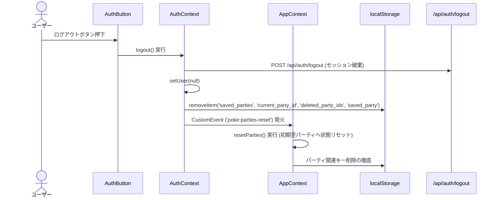

# 125. ログアウト時のlocalStorageパーティデータ全リセット・削除計画

## 1. 背景と目的
ユーザーがログアウトした際、現在ブラウザの `localStorage` に保存されているパーティデータがそのまま残存していると、同一端末・ブラウザを共有する別のユーザーや、ログアウト後の未ログイン状態において前アカウントのパーティデータが閲覧・操作されてしまう懸念があります。
プライバシー保護とセキュアなマルチユーザー利用を実現するため、**ログアウト実行時に `localStorage` 内のすべてのパーティ関連データを完全にリセット・削除し、画面上のパーティ状態も初期状態（空の新規パーティ）へとクリア**します。

---

## 2. 削除対象となる localStorage キー
- `saved_parties`: ローカル保存されている全パーティ配列
- `current_party_id`: 現在選択中のパーティID
- `deleted_party_ids`: 同期用の削除済みパーティIDリスト（Tombstone）
- `saved_party`: 旧バージョンの単一パーティ保存用キー（存在する場合）

※言語設定（`lang`）、テーマ設定（`theme`）、Cookie同意（`poke_cookie_consent`）、UI設定（`auto_advance_enabled`）等は端末設定であるため保持します。

---

## 3. アーキテクチャと連携フロー

### 連携フロー

### コンポーネントおよびコンテキストの役割
1. **`AuthContext.tsx`**:
   - `logout()` 処理の `finally` ブロックにて、`localStorage` から対象キーを削除。
   - `window.dispatchEvent(new CustomEvent('poke:parties-reset'))` を発火してアプリケーション全体へ通知。
2. **`AppContext.tsx`**:
   - `resetParties()` メソッドを提供（`AppContextType` に追加）。
   - `poke:parties-reset` イベントリスナーを登録。
   - イベント検知時に、`parties` を初期の単一空パーティ（`マイチャンピオンズパーティ`）に再生成・置換し、`currentPartyId` をその新規IDに設定。`pendingPokemonToAdd` などの編集一時状態もクリア。
3. **`usePartySync.ts`**:
   - 既存のロジックにより、`user` が `null` の場合はクラウドとの同期チェック（`checkAndSync`）を即時中断するため、不要な再同期や誤アップロードは発生しません。

---

## 4. TDD (テスト駆動開発) 実施計画

### Phase 1: テストコードの作成 (Red)
1. **`src/context/AuthContext.test.tsx`**:
   - 事前に `localStorage` に `saved_parties`, `current_party_id`, `deleted_party_ids` をセット。
   - `logout()` を実行した際、これらのキーがすべて `localStorage` から削除されることを検証。
   - `poke:parties-reset` イベントがディスパッチされることを検証。
2. **`src/context/AppContext.test.tsx`**:
   - パーティが複数登録されている状態で `poke:parties-reset` イベントを受信、または `resetParties()` を呼び出した際、`parties` の要素数が初期の1件（空のパーティ）になり、`currentPartyId` が初期化されることを検証。

### Phase 2: 実装 (Green)
1. `src/context/AuthContext.tsx` の `logout` にパーティ削除・イベント発火処理を実装。
2. `src/context/AppContext.tsx` に `resetParties` 実装および `poke:parties-reset` リスナーを追加。
3. テストが Green になることを確認。

### Phase 3: クリーンアップと検証 (Refactor)
1. Biome によるコード整形と lint チェック。
2. 全テストスイート（48ファイル・293+α件）の実行。
3. `npm run build` によるプロダクションビルド検証。

---

## 5. 合意確認項目
- ログアウト時に削除する対象は、パーティ関連（`saved_parties`, `current_party_id`, `deleted_party_ids`, `saved_party`）で問題ないか。
- ログアウト後の画面上のパーティ表示は、初期状態の空パーティ1枠（デフォルト表示）に切り替える動作で問題ないか。
