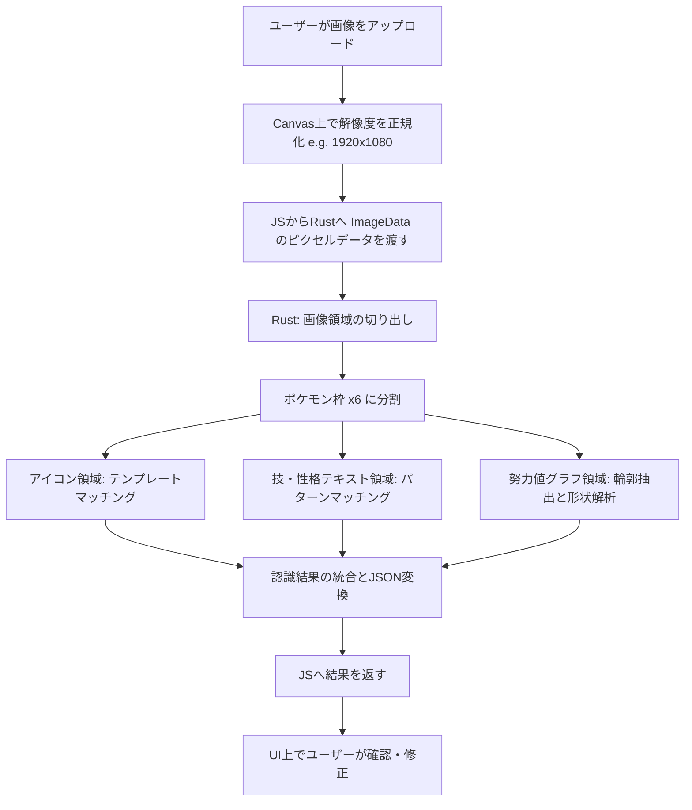

# 04_wasm_image_analysis_design.md - WASM画像解析の技術方針と詳細設計

本ドキュメントでは、ブラウザ上（WebAssembly）で実行するパーティ画像の解析技術方針、認識アルゴリズム、および使用するライブラリについて計画します。

---

## 1. 解析対象と目標データ

解析対象は、ゲーム内（ポケモンチャンピオンズ）のパーティ詳細画面または対戦準備画面のスクリーンショットです。
ここから以下の情報をローカル（WASM）で自動抽出することを目指します。

1. **ポケモンの特定**: アイコン画像または名前テキストの認識
2. **性格・特性**: テキスト情報の認識
3. **技 (4つ)**: テキスト情報の認識
4. **努力値の割り振り**: グラフ画像（レーダーチャート）の形状解析、または努力値詳細数値の認識

---

## 2. 技術的アプローチの選定

ブラウザでの実行速度と認識精度のバランスを考慮し、以下の3つのアプローチを検討します。

### アプローチ A: 汎用OCR (光学文字認識)
- **方法**: Tesseract.js などの既存のWASM OCRエンジンを使用し、画像全体または切り出したテキスト領域から文字を認識する。
- **メリット**: 新しいポケモンや技が追加されても、テキストデータさえ合致すれば認識可能。
- **デメリット**: ゲーム特有のフォント、背景グラデーション、低解像度画像において誤認識が発生しやすい。また、WASMモジュールのファイルサイズが数MB〜数十MBと大きくなり、初期ロードに時間がかかる。

### アプローチ B: テンプレートマッチング & パターン比較 【★推奨】
- **方法**: ゲームのUIレイアウトが固定されている点を利用する。
  1. 画像の解像度をアスペクト比（例: 16:9）に基づき標準サイズに正規化する。
  2. ポケモンのアイコン、技名、性格などの表示位置（座標）を特定し、トリミングする。
  3. あらかじめ用意した「ポケモンのアイコン画像セット」や「技名の文字画像特徴量」と、トリミングした画像を比較（テンプレートマッチングやハッシュ値比較）する。
- **メリット**: 
  - 処理が非常に高速で、WASMのモジュールサイズを極めて小さく（数百KB程度）抑えられる。
  - フォントやアイコンが固定であるため、認識精度がほぼ100%に近い状態を維持できる。
- **デメリット**:
  - 新しいポケモンや技、UIの変更があった場合に、マスター画像や座標定義の更新が必要。

### アプローチ C: ハイブリッドアプローチ (画像解析による数値化)
- **努力値の解析**: 努力値がレーダーチャート（グラフ）で表示されている場合、グラフ部分の画像を二値化し、中心点からの距離（輪郭検出）によって数値を推定する。

---

## 3. Rust + WASM 画像解析スタック

Rustを用いて軽量かつ高速な画像処理エンジンを構築します。

- **`image` クレート**:
  - 画像のデコード、トリミング、グレースケール化、二値化などの基本画像操作に使用。
- **`imageproc` クレート**:
  - 輪郭検出、テンプレートマッチング、ハッシュ比較（Perceptual Hashなど）などの画像処理アルゴリズムを提供。
- **`wasm-bindgen` & `web-sys`**:
  - HTML5 Canvasの `ImageData`（ピクセル配列）をRustのメモリへ超高速に転送し、ゼロコピーまたは最小限のコピーで処理を行う。

---

## 4. 解析パイプライン（処理の流れ）

---

## 5. 合意形成と次のステップ

画像解析方針として、精度と読み込み速度の観点から **「アプローチB（テンプレートマッチング & パターン比較）＋ 努力値グラフの二値化形状解析」** を基本方針とすることを提案します。

この方針に合意が得られた場合、次は **「ポケモンデータ・技データの構造定義と火力・耐久計算ロジック（plan/05_data_and_calculation_design.md）」** の計画に進みます。
