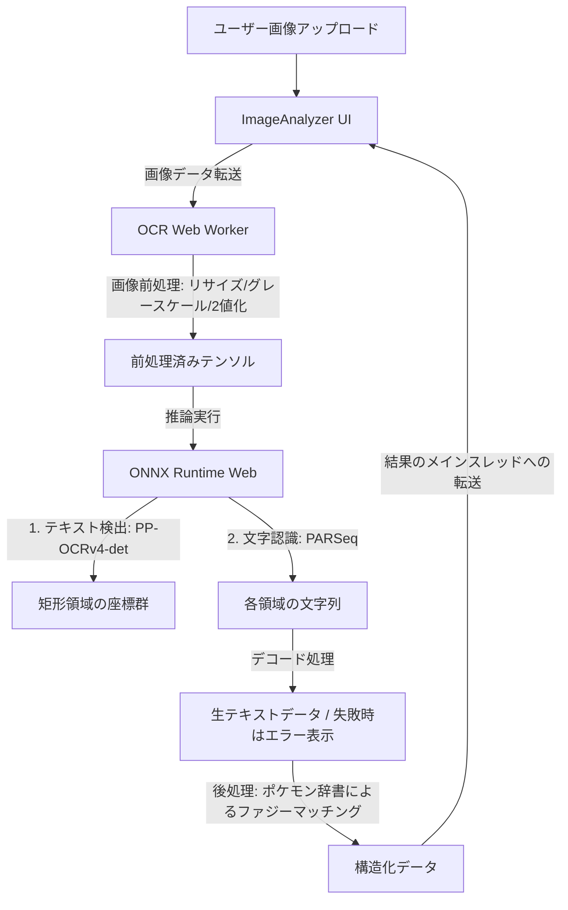

# 計画書: NDLOCR-Lite Webをベースにしたブラウザ完結型OCR機能の再構築 (66_ocr_feature_ndlocr_lite_plan.md)

本計画は、`yuta1984/ndlocrlite-web` のアーキテクチャ（ONNX Runtime Web + Web Worker による非同期処理 + IndexedDB モデルキャッシュ）をベースにして、ポケモンステータス画面などの画像から各種情報（ポケモン名、ステータス実数値、特性、技など）をクライアントサイドのみで高精度に読み取るOCR機能を再構築する計画です。

---

## 1. 背景と目的
以前実装されていたOCR機能は、メンテナンス性やビルドサイズ、Rust WASMコンパイルの複雑さなどの理由から一度完全に削除されました。
しかし、ステータス画面のスクリーンショットから手軽に入力を行いたいという需要に対応するため、以下の要件を満たすクリーンなクライアントサイド完結型OCRを再実装します。

*   **サーバーレス・プライバシー保護**: すべての推論処理をブラウザ上で実行し、サーバーへの画像送信を行わない。
*   **非ブロッキング**: Web Worker 上で ONNX Runtime Web を実行し、UIスレッドをブロックしない。
*   **起動高速化**: IndexedDB を使用して ONNX モデルファイルをブラウザにキャッシュし、2回目以降のロードを高速化する。

---

### 2. 採用するONNXモデルと仕様

本OCR機能では、ブラウザでの初回ロード時間の短縮（軽量性）と、日本語の文字認識精度の高さを両立するため、以下のハイブリッドなモデル構成を採用します。

### ① テキスト検出（レイアウト認識）モデル: PP-OCRv4-det (Mobile版)
*   **ファイルサイズ**: 約 2.3MB
*   **採用理由**: 極めて軽量であり、初回起動時のダウンロード負荷を大幅に削減。ゲームのスクリーンショットUIは整った横書きのため、これで十分に検出可能。
*   **後処理**: DBNetの出力をデコードし、テキストの矩形領域（Bounding Box）の座標リストを生成します。

### ② 文字認識モデル: PARSeq (NDL版)
*   **ファイルサイズ**: 約 25MB 〜 30MB × 3（文字数カスケード構成: 30/50/100文字）
*   **採用理由**: `ndlocrlite-web` で使用されている高性能な日本語OCRモデルを流用し、文字認識の精度を最大化します。
*   **構成**: `ndlocrlite-web` のカスケードデコーダーおよび推論フローを再利用します。

### ③ 対応言語とエラーハンドリング
*   **対応言語**: **日本語のみ**（多言語は対象外とし、日本語と数値の認識に特化します）。
*   **エラーハンドリング**: 画像から文字認識ができなかった場合、または低確率で文字が読み取れなかった場合は、解析結果画面（UI）に **「認識できませんでした」** と表示します。

---

## 3. 実装アーキテクチャ設計

`ndlocrlite-web` の構造を踏襲し、本プロジェクトに適した形で以下のように設計します。

### 3.1. 前処理と後処理
*   **画像前処理**: Canvas API を用いて画像を適切なサイズ（検出モデルの入力サイズ、例: `1024x1024` または `640x640`）にリサイズし、RGB（またはグレースケール）テンソルに変換します。
*   **ファジーマッチング（精度向上の鍵）**:
    ゲームUI of OCRでは、フォントやノイズによる誤認識（例: 「ピカチユウ」→「ピカチュウ」, 「こうげき」→「こうげき」）が発生しやすいため、OCRエンジンが返した生テキストを、プロジェクトが保持する共通マスタデータ（ポケモン名、特性、技、持ち物リスト）と**レーベンシュタイン距離**などを用いてファジーマッチングを行い、最も近い正しい語彙へ自動補正します。
*   **認識エラー時の表示**:
    推論結果の信頼度スコアが極端に低い場合や、何も文字が抽出できなかったフィールドには、空欄にせず明示的に「認識できませんでした」と表示します。

---

## 4. 開発・統合ステップ

### Step 1: 依存関係の導入と初期設定
*   `onnxruntime-web` のインストール。
*   Web Worker のセットアップと Vite でのアセット読み込み設定。
*   ONNXモデルのダウンロードおよび IndexedDB への保存・キャッシュロジックの実装。

### Step 2: OCR 実行エンジンの実装 (Web Worker)
*   PP-OCRv4-det (検出) および PARSeq (認識) のモデルロード処理の実装。
*   画像テンソル変換（前処理）および推論結果のデコード（後処理）の実装。
*   検出できた各矩形に対し、PARSeqを適用して文字を取得するパイプライン処理の記述。

### Step 3: ポケモン語彙ファジーマッチングロジックの実装 (TDD)
*   OCRの生テキストから、最も類似度の高いポケモン名・特性・技名・数値を高精度でマッチングするユーティリティ関数の開発。
*   Vitest を用いた単体テスト（Red-Green-Refactorサイクル）の実施。

### Step 4: UIコンポーネント (ImageAnalyzer) の実装
*   ダッシュボードからアクセス可能な画像解析タブの再作成。
*   ドラッグ＆ドロップによる画像アップロード、ローディング進捗、解析結果プレビュー、および「パーティシミュレーター」へのインポート機能の実装。
*   認識不能な項目に対して「認識できませんでした」と表示するUI処理の追加。

### Step 5: 結合テストと精度評価
*   `sample/` ディレクトリに退避されているゲーム画面スクリーンショットフィクスチャを使用し、総合的な読み取り精度と動作速度を検証。

---

## 5. 合意済みの基本仕様

1.  **モデル構成**:
    *   検出: `PP-OCRv4-det` (軽量・高速)
    *   認識: `PARSeq (NDL版)` (高精度日本語)
2.  **言語サポート**: 日本語のみ。
3.  **UI表示**:
    *   画像分析専用タブを設け、解析結果からシミュレーター等へインポートできるようにする。
    *   認識に失敗した項目は「認識できませんでした」とUI上に表示する。
