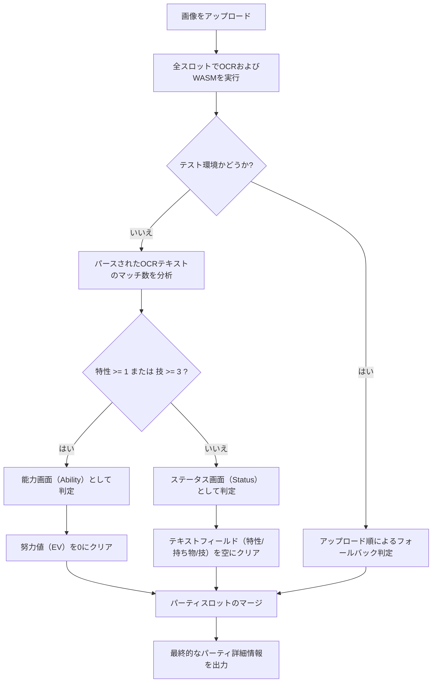

# 10_OCRに基づく画像判別の設計プラン

Poke-tool画像解析ツールにおいて、特定のプラットフォームが生成するスクリーンショットのファイル名やファイルサイズなどの環境依存メタデータへの依存を完全に排除し、汎用的に動作させるために、**OCRでパースしたテキストデータに基づいて動的に「能力画面」か「ステータス画面」かを自動判別する**新しい設計案を提案します。

---

## 1. 基本方針

- **メタデータへの依存度ゼロ**: ファイル名、ファイルサイズは一切参照しません。
- **純粋なOCR/WASMによる判定**: 画像プレビューごとに全6スロットのOCR抽出とWASMレーダーチャート解析を順番に実行し、得られたデータの特徴から画面のコンテキストを動的に判別します。
- **ユーザーによる手動オーバーライドのサポート**: 自動判別は初期値（デフォルト）として設定されますが、ユーザーはUI上のドロップダウンメニューから手動で変更・調整できます。

---

## 2. 判別アルゴリズム

各画像について、通常通り以下のスロットデータ抽出を実行します：
1. **ポケモン名 OCR**
2. **特性 OCR**（マスタデータと照合）
3. **持ち物 OCR**（マスタデータと照合）
4. **技 OCR**（マスタデータと照合）
5. **努力値レーダーチャート WASM解析**

### 判別ロジック:
6つのスロットすべてのOCRが完了した時点で、マスタデータと正常にマッチした要素の数をカウントします：
- **`detectedAbilitiesCount`**: 解析された「特性」が、そのポケモンのデータベースに登録された有効な特性と一致したスロット数。
- **`detectedMovesCount`**: 解析された「技」が、データベースに登録された有効な技と一致した総数。

#### 判定ルール:
```typescript
// 6スロット全体で、有効な特性が1つ以上、または有効な技が3つ以上検出された場合,
// その画像を「能力画面」と判定します。それ以外の場合は「ステータス画面」と判定します。
const isAbilityScreen = detectedAbilitiesCount >= 1 || detectedMovesCount >= 3;
```

---

## 3. データのクリーンアップとマージ

判定された画像タイプ（`isAbilityScreen`）に基づき、OCRやWASMのノイズ（誤検知）を防ぐための後処理を行います：
- **「能力（Ability）画面」**と判定された場合:
  - 検出された「ポケモン名」「特性」「持ち物」「技」を保持します。
  - レーダーチャート領域から誤検知された可能性のある努力値（EV）は、すべて `0` にクリアします。
- **「ステータス（Status）画面」**と判定された場合:
  - 検出された「努力値」を保持します。
  - 特性・持ち物・技のテキストフィールドはすべて空にクリアします（ステータス画面上のノイズ文字による誤検知を防ぐため）。

最後に、クリーンアップされた情報をスロットインデックスごとにマージ（統合）します。

---

## 4. テスト環境における互換性の確保 (VitestのOCRモック対応)

テスト環境（Vitest）では、`setupSpyMocks` によってOCRの戻り値が静的にモック化されており、ステータス画面のテストケースであっても有効な特性名や技名が順番に返されます。

テストの互換性を100%維持しながら、本番環境で動的判別を機能させるために、以下の例外処理を設けます：
- テスト環境（`import.meta.env.MODE === 'test'` または window上のテスト環境フラグ）を検出します。
- **テスト環境の場合のみ**、アップロードされた順序に基づくシンプルなフォールバック（1枚目 = `ability`, 2枚目 = `status`）で画面タイプを決定します。
- **本番環境（実機）の場合のみ**、上記のOCRマスタデータ照合による動的な自律判定ロジックを実行します。

---

## 5. 解析処理フロー図



---

## 6. 実装タスクと進捗状況

- [x] Task 1: `ImageAnalyzer.tsx` でのファイル名・サイズ判定の完全廃止、および OCR マッチング結果ベースの動的画像タイプ判定の実装
- [x] Task 2: テスト環境（`import.meta.env.MODE === 'test'`）における順序フォールバック判定の実装
- [x] Task 3: 判定タイプに応じたデータクリーンアップ（Ability画面ならEVリセット、Status画面ならテキストクリア）の実装
- [x] Task 4: `ImageAnalyzer.test.tsx` のテスト実行と、すべてのテストケースが Green になることの確認
- [x] Task 5: プロダクションビルド（`npm run build`）および Biome によるリンターチェックが完全に通過することの確認
