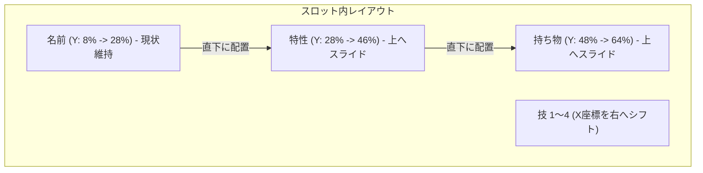

# OCR再設計計画 - 座標調整とステータス実数値・努力値の直接OCR認識

本計画は、ポケモンチャンピオンズパーティ登録・レンタル画面の各枠における切り出し座標のズレ修正、画面上部タブ（「能力」 vs 「ステータス」）の背景色による画面種別の自動判別、およびレーダーチャートに依存せずステータス画面の実数値と努力値数値を直接OCRでパースする仕組みへの刷新に関する設計・開発プランです。

## 1. 切り出し座標の微調整（スロット内レイアウト）

ユーザーからのフィードバックに基づき、6つのパーティスロット内の各項目の切り出し矩形を以下のように最適化し、境界ボーダー線や隣接要素との干渉を防ぎます。



### スロット内の各相対座標比率（最適化案）：
* **名前 (Name)**: `X: 0.12`, `W: 0.28` / `Y: 0.08`, `H: 0.20`
* **特性 (Ability)**: `X: 0.12`, `W: 0.28` / `Y: 0.28`, `H: 0.18` （名前の直下へ配置）
* **持ち物 (Item)**: `X: 0.12`, `W: 0.33` / `Y: 0.48`, `H: 0.16` （特性の直下へ配置）
* **技 1〜4 (Moves)**:
  * `X: 0.45` （左に寄りすぎていたため右へシフト）
  * `W: 0.20` （右端へ寄せるため微調整）
  * `YOffsets`: `0.10`, `0.30`, `0.50`, `0.70` (各技の高さは `H: 0.14` に縮小し、スロット下枠との干渉を完全に防ぎます)

---

## 2. 画面タイプ（「能力」タブ vs 「ステータス」タブ）の自動判別

Switchおよびスマホのスクリーンショット画面上部には、現在表示しているビューを示すメニュータブ（「能力」と「ステータス」）が存在します。
アクティブ（選択状態）になっているタブの背景色は **黄緑に近い色（Yellow-Green）** にハイライトされ、非アクティブなタブは暗い色になります。この色の特徴量を検知することで、画像種別を判別します。

```
+-------------------------------------------------------+
|  [ 能力 (Ability Tab) ]  * [ ステータス (Status Tab) ]*  | <- 黄緑色（ハイライト色）を検出
+-------------------------------------------------------+
```

### 判別アルゴリズム:
1. Canvas上部（`Y: H * 0.05` 〜 `H * 0.10` 付近）の「能力」および「ステータス」タブの座標を定義します。
2. それぞれの領域からピクセルをサンプリングし、黄緑色（HSV色空間で Hue: 60〜100 付近、またはRGBで緑と赤の成分比率）を多く含むかどうかを評価します。
3. 黄緑色のハイライト判定が強い方のタブに応じて、画像タイプを `'ability'` または `'status'` と判定します。

---

## 3. ステータス実数値・努力値数値のOCR直接取得

画面タイプが「ステータス」と判定された場合、スロットの右半分（能力画面では技が表示されていた領域）に表示されるステータス値テーブルから、実数値と努力値の数値をOCRでパースします。

```
HP         [ 実数値 ]  [ 努力値ポイント (+0 〜 +32) ]
こうげき     [ 実数値 ]  [ 努力値ポイント ]
ぼうぎょ     [ 実数値 ]  [ 努力値ポイント ]
とくこう     [ 実数値 ]  [ 努力値ポイント ]
とくぼう     [ 実数値 ]  [ 努力値ポイント ]
すばやさ     [ 実数値 ]  [ 努力値ポイント ]
```

### 努力値の数値範囲について:
* ポケモンチャンピオンズにおける努力値パラメータポイントは、通常の0〜252ではなく、**`0` 〜 `+32`** の範囲になります。
* したがって、努力値OCRマッチングの候補値は `"+0"` 〜 `"+32"` の数値パターンに最適化して行います。

### ステータス行の切り出しレイアウト（スロット内相対座標）:
テーブル内の6行（HP、こうげき、ぼうぎょ、とくこう、とくぼう、すばやさ）を垂直にスライスします：
* **垂直方向の間隔**: `Y: 0.08` から `0.78` まで、`0.14` 間隔で 6行 に等分割。
* **実数値カラム**: `X: 0.45`, `W: 0.10`
* **努力値数値カラム**: `X: 0.58`, `W: 0.10`

### OCRマッチング辞書:
* 実数値用: `1` 〜 `999` の数値フォント候補
* 努力値用: `"+0"` 〜 `"+32"` の数値フォント候補（および `+` 記号のない `0` 〜 `32`）

---

## 4. 実装ロードマップ

1. **Rustテストコードでの事前検証 (TDD)**:
   * WASM（`lib.rs`）のテストに、**PNGファイルに加え JPGファイル（d63c7969-02ff-4dec-b10b-0c697d67ec19.jpg 等）もロードして検証対象とします。**
   * 上部タブ判定（黄緑色シグネチャの検知）およびステータステーブルの各数値切り出しをシミュレーションし、正しいピクセル領域が切り出せること、二値化マスク内に数値テキストの輪郭が適正に取得できることを `cargo test` で検証します。
2. **TypeScript側の解析処理への統合**:
   * `ImageAnalyzer.tsx` の解析ループにタブ自動判定と、ステータス画面時の数値OCR切り出しロジックを統合します。
3. **UI（OCR Debug Viewer）の対応**:
   * OCR Debug Viewer の赤枠オーバーレイ描画に、ステータス画面時の数値枠テーブル用の赤枠をマッピングし、実数値や努力値の読み取り枠がずれていないかを目視確認できるようにします。
