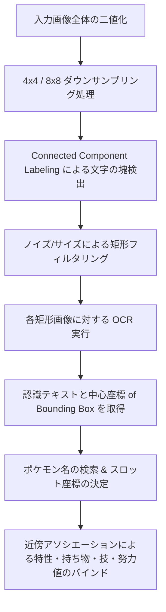

# OCR再設計計画 - 固定枠切り出しの全撤廃と画像全体からの動的テキスト領域検出・近傍結合方式への移行

本計画は、ユーザーからのフィードバックに基づき、デバイスごとの解像度やアスペクト比の違い（黒帯やナビバーの有無）によってズレが発生しやすい「固定比率ベースの切り出し枠」を**完全に撤廃**し、画像全体からテキストが存在する領域を動的に抽出して OCR にかけ、それらの認識テキストと座標情報からスロットデータを再構築する「レイアウト非依存型 OCR エンジン」への再設計・開発プランです。

---

## 1. 課題と新アーキテクチャの背景

### 従来の課題
* スマホ（アスペクト比が多様、ステータスバーの有無）や Switch（16:9 キャプチャ）の双方に対応するため、アスペクト比調整や切り出し座標の比率微調整を繰り返してきたが、周囲の余白や歪みにより固定切り出し位置がズレてしまい、誤認識が避けられなかった。

### 解決策（本計画のコア）
1. **「固定比率テンプレート切り出し」を完全に廃止**する。
2. **接続領域ラベリング（Connected Component Analysis）**を用いて、画像全体の明るいピクセル（白・黄・黄緑のテキストピクセル）の密集部分を「文字ブロック（Bounding Box）」として動的に検出する。
3. 検出された各文字ブロックをクロップし、二値化マッチング OCR（`ocr.runOcrInference`）を実行してテキストの一覧を取得する。
4. 得られたテキストとそれぞれの代表座標 `(X, Y)` から、意味的な近傍位置関係に基づいて 6 体のスロット（ポケモン名、特性、持ち物、技、努力値）を構築・紐付ける。

---

## 2. アルゴリズム設計

### (1) 動的テキストブロック検出（JS & Rust WASM）
* **二値化**: ピクセル `(r, g, b)` が `r > 150 && g > 150 && b > 150`（白系）または `g > 150 && r > 150 && b < 100`（黄色・黄緑系）の場合に「テキストピクセル = 1」とする。
* **ブロック化**: 高速化と文字同士の結合のため、画像を `8x8` または `4x4` のブロックにダウンサンプリング。ブロック内に文字ピクセルが閾値以上あれば「アクティブ（文字あり）」と判定。
* **接続成分のラベリング**: アクティブなブロックの接続（8方向近傍）を走査し、1つの矩形 `(X, Y, W, H)` にラベリング。
* **フィルタリング**:
  * ポケモン名、技、特性、持ち物、努力値としてあり得るサイズ範囲（例：高さ `15px`〜`120px`）に限定し、背景のアイコン画像やグリッド線、ドットノイズを完全に除外。

### (2) OCR マッチングの最適化
抽出された個々の矩形画像に対し、`ocr.runOcrInference` を実行します。
ハミング距離計算の効率化（処理時間短縮）のため、矩形の形状・アスペクト比 `(W/H)` および Y座標から候補（Candidates）を絞り込みます：
* **アスペクト比が極端に短い（W/H < 1.5）または右側に位置する**: 努力値・実数値数値候補（`+0`〜`+32`、`0`〜`999`）を優先。
* **アスペクト比が長い（W/H >= 1.5）**: ポケモン名、特性、持ち物、技のマスターデータを結合したリストでマッチング。

### (3) セマンティック近傍結合（Proximity Association）
得られた `{ text, x, y, w, h }` のリストから、スロット情報を再構築します。

1. **ポケモン名の位置 `(Px, Py)` の特定**:
   * 認識テキストから `PokemonMaster` に完全・部分一致するものを最大6個特定する。
   * これらが画像全体の X 座標に応じて「左カラム（X < 50%）」と「右カラム（X >= 50%）」に自動で振り分けられ、Y 座標に応じてスロット 1〜6 に決定される。
2. **特性・持ち物のバインド**:
   * 同一スロット内（同じカラム内）で、ポケモン名 `(Px, Py)` の X座標に近く、Y座標が `Py` より少し下（`Py < y < Py + スロット高`）にあるテキストを特性、その下にあるテキストを持ち物と特定。
3. **技 / 努力値数値のバインド**:
   * ポケモン名 `(Px, Py)` の右側（`x > Px + Pw`）にあり、同じスロットの高さの範囲内にあるテキスト群を検索。
   * 特性/技画面の場合 ➔ 4つの技としてバインド。
   * ステータス画面の場合 ➔ `+32` などの努力値数値、または実数値を特定し、縦の並び順（上から HP, こうげき, ぼうぎょ, とくこう, とくぼう, すばやさ）で順にバインド。

---

## 3. OCR Debug Viewer の表示

* **検出枠と認識テキストの重ね合わせ表示**:
  * 抽出されたすべてのテキスト矩形を、その座標通りに画像の上にオーバーレイ表示（枠線の描画）します。
  * 枠の色は、認識結果の分類に応じて動的に変更（例：ポケモン名は赤、特性/持ち物は緑、技は紫、努力値は青など）。
  * 枠をホバーすると、実際に画像内のその場所から何という文字が OCR 判定されたのかが表示されます。

---

## 4. 開発ロードマップとTDD

1. **計画の合意 (本ステップ)**
   * ユーザーから計画に対する承認を得ます。
2. **文字領域検出器（Connected Component Labeling）の Rust WASM 実装とテスト**:
   * `src/wasm-analysis/src/lib.rs` に、ダウンサンプリング二値画像からの矩形抽出アルゴリズムを実装。
   * 既存の JPG フィクスチャを用いたテストコードを追加し、座標テーブルを使わずともポケモン名、特性、持ち物、技などのテキスト領域が正確なバウンディングボックスとして検出されることを `cargo test` で検証。
3. **TypeScript 側での全スキャン & 近傍アソシエーションロジックの実装**:
   * `ImageAnalyzer.tsx` を全面的にリファクタリング。固定座標ループを廃止し、WASM による矩形抽出 ➔ OCR ➔ 幾何学的近傍マッピング ➔ パーティマージの処理に置き換え。
4. **Vitest 単体・結合テストの修正**:
   * 従来の crop 座標モックを廃止し、新しい全体 OCR テキスト認識リストおよび幾何学的結合ルールに対応するよう `ImageAnalyzer.test.tsx` のモック構造を調整し、テストを Green にする。
